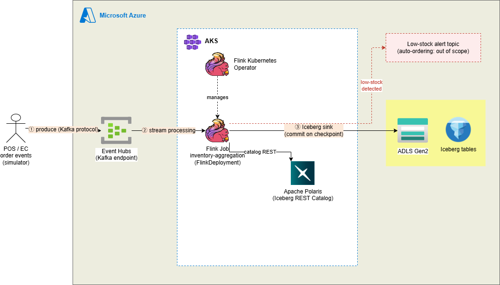

# Azure Realtime Lakehouse

在庫減少をリアルタイムに検知するストリーミング基盤。Azure Event Hubs → Flink on AKS → Apache Iceberg（ADLS2 + Apache Polaris）という構成で、「日次バッチでは検知が翌朝になる」という遅延を解消することにフォーカスしたポートフォリオです。

---

## なぜこれをやるのか

従来の在庫管理は日次バッチ集計が前提になっていることが多く、当日発生した欠品は翌朝のバッチ実行まで検知されません。その間、

- **機会損失**：商品があれば売れていたはずの売上を、検知が遅れた分だけ失う
- **過剰在庫リスク**：逆に「欠品が怖いから多めに持つ」という安全マージンの取り方になりがちで、倉庫コストや売れ残りリスクを抱え込む

という、攻め（機会損失）と守り（在庫コスト）の両方にトレードオフが生じます。ストリーミングで在庫変動をリアルタイムに検知できれば、検知ラグが縮む分だけこのトレードオフ自体を緩和できる、というのがこのプロジェクトの仮説です。

### スコープ

このリポジトリが実装するのは、**在庫減少のリアルタイム検知〜Icebergテーブルへの格納までのストリーミング基盤部分**です。検知結果を受けた自動発注ロジックや、発注先システムとの連携は対象外です。あくまで「リアルタイム性のある検知基盤を、本番運用を想定した構成（IaC化・K8s運用）で構築できる」ことの証明が目的です。

シミュレータによる合成データを使うため、「機会損失○％削減」のような効果の定量化は行いません（行えません）。目的はそこではなく、「欠品を恐れて在庫を過剰に抱える」「そのせいで倉庫を余分に確保し続ける」といった、検知の遅さに起因する現状からの解放です。定量効果ではなく、その現状を変えうる検知基盤を実際に動く形で示すことがゴールです。

---

## アーキテクチャ



- **Event Hubs**：Kafka protocol互換エンドポイントを使い、Flinkからは通常のKafkaソースとして接続する
- **Flink on AKS**：Flink Kubernetes OperatorでFlinkDeployment CRDとしてジョブを管理。商品ごとに現在庫数をstateとして保持し、イベントごとに即時更新・閾値判定（詳細はADR参照）した結果をIcebergにsink
- **ADLS2 + Polaris**：データ実体はADLS2に、テーブルの最新状態（metadata.jsonへのポインタ）はPolarisが管理。クラウド中立なREST Catalog仕様で構築し、特定ベンダーへのロックインを避ける

検知結果の確認・動作検証は、別途クエリエンジンを立てず`pyiceberg`等によるカタログ越しの直接読み出しで行う（コンポーネントを増やさない方針。詳細はADR参照）。

---

## 技術スタック

| レイヤ | 技術 |
|---|---|
| メッセージング | Azure Event Hubs（Kafka protocol互換） |
| ストリーム処理 | Apache Flink（Flink Kubernetes Operator） |
| コンテナ基盤 | Azure Kubernetes Service (AKS) |
| ストレージ | Azure Data Lake Storage Gen2 (ADLS2) |
| テーブルフォーマット | Apache Iceberg |
| カタログ | Apache Polaris（Iceberg REST Catalog） |
| インフラ | Terraform |
| CI/CD | GitHub Actions |

---

## ディレクトリ構成

```
.
├── terraform/
│   ├── modules/
│   │   ├── aks/                # AKSクラスタ本体
│   │   ├── event_hubs/         # Event Hubs namespace + Kafka互換設定
│   │   ├── adls2/              # ストレージアカウント + コンテナ
│   │   ├── networking/         # VNet, Subnet
│   │   └── acr/                # sql-runnerイメージ置き場、AKSにAcrPull付与
│   └── env/
│       └── dev/                # `terraform output`で各種接続情報を取得
├── k8s/
│   ├── flink-operator/         # Flink Kubernetes OperatorのHelmインストール
│   ├── polaris/                # Polaris本体（Deployment + Service、in-memory）
│   └── flink-deployment/       # FlinkDeployment CRD + secretsからのenvsubst&apply
├── flink-jobs/
│   ├── inventory-monitor/      # 在庫減少検知ジョブ（4本のFlink SQL）
│   └── sql-runner/             # SQLファイルを順に実行する自作Javaランナー
├── simulator/
│   └── inventory-event-producer/  # 在庫変動イベントのシミュレータ（Python）
├── scripts/                    # 動作確認・メンテナンス用（後述）
└── .github/workflows/          # terraform apply/destroy、Icebergメンテナンス
```

---

## どのスクリプトが何を作るか

スクリプトはすべて手元PCで実行し、`kubectl`/`helm`/`az`経由でAKSに指示を出す。**AKSの中でスクリプトは動かない**。

AKSに最終的にできるもの（すべてPod）:

```
flinkの名前空間
 ├─ flink-kubernetes-operator      Flinkジョブを管理する番人
 ├─ polaris                        Iceberg REST Catalogサーバー
 └─ inventory-monitor              JobManager / TaskManager（FlinkDeploymentからOperatorが生成）
cert-manager（3 Pod）              Operatorのwebhook用の証明書発行
```

| スクリプト | 何をするか | 結果 |
|---|---|---|
| `k8s/flink-operator/install.sh` | cert-manager と Flink Kubernetes Operator を導入 | Operator Pod、`FlinkDeployment` CRD |
| `flink-jobs/sql-runner/build-and-push.sh` | sql-runnerをビルドしACRへpush | ACR上のイメージ（Podはまだできない） |
| `k8s/flink-deployment/01_render-and-deploy.sh` | 秘密情報をSQLに埋めてConfigMapと`FlinkDeployment`を適用 | Operatorが JobManager/TaskManager Pod を生成 |
| `scripts/setup-polaris.sh` | 起動済みPolarisにカタログとFlink用principalを登録 | Podは増えない。Polarisの中身が入る |
| `scripts/setup-oidc.sh` | GitHub Actions用のOIDC認証をAzureに登録（初回のみ） | Azure ADのアプリ登録 |

Polaris自体のデプロイはスクリプトではなく、`k8s/polaris/`のYAMLを`kubectl apply`する。なお「flink」は、Kubernetesの名前空間（Polarisも同居）・Flinkのソフト本体・`flink-jobs/`ディレクトリの3つの意味で使っている。

---

## 検証状況

実機（Azure従量課金）で層ごとに確認した結果。**コアパイプライン（シミュレータ→Event Hubs→Flink→Polaris→Iceberg on ADLS2）は最後まで通した**。CI/CDのみ未検証（スコープ外）。

| 層 | 状態 |
|---|---|
| Terraform（11リソース + AKS kubelet identityへのStorage RBAC）/ ADLS2のfirewall経由アクセス | 確認済み |
| Event Hubs（Kafka互換）へのシミュレータ送信と読み戻し | 確認済み |
| AKS / cert-manager + Flink Kubernetes Operator 1.16.x | 確認済み |
| Polaris 1.7.0（AKS上で起動、カタログ・専用principalの初期化） | 確認済み |
| sql-runnerイメージのbuild → ACR push → Podでpull | 確認済み |
| `FlinkDeployment`（Kafka → Iceberg on Polaris）の稼働 | **確認済み**。CreateTable〜継続的なチェックポイント〜Icebergスナップショットのコミットまで安定稼働 |
| Kafkaからの実読み取り、event_timeの型 | 確認済み。`TIMESTAMP_LTZ(3)`＋`Z`サフィックスで解決（詳細はADR参照） |
| Icebergへの書き込み（ADLS2） | **確認済み**。`inventory.stock_status`に複数スナップショットが実際にコミットされ、`table.metadata.snapshots`で内容確認済み |
| 検証スクリプト（`verify_stock_status.py`） | **確認済み**（ただしpyicebergのequality delete未対応制限により、スナップショット/マニフェストのメタデータ確認にフォールバック。詳細はADR参照） |
| CI/CD、Icebergメンテナンス（`expire_snapshots.py`） | 未検証（スコープ外、コード完成のみ） |

---

## 動かし方

検証セッションごとにインフラを作って壊す運用（コスト管理のため）。手順は実機で通した順序:

1. **インフラをapply**
   ```bash
   cd terraform/env/dev
   cp dev.tfvars.example dev.tfvars   # 自宅IPを記入
   terraform apply -var-file=dev.tfvars
   ```
2. **kubectlをAKSに接続**
   ```bash
   az aks get-credentials --resource-group $(terraform output -raw resource_group_name) \
     --name $(terraform output -raw aks_cluster_name)
   ```
3. **Flink Kubernetes Operatorをインストール**: `k8s/flink-operator/install.sh`（cert-managerも入る）
4. **Polarisをデプロイ**: `k8s/polaris/01_secret.example.yaml`を`01_secret.yaml`にコピーして認証情報を埋め、**4ファイルを明示して**適用する（`-f k8s/polaris/`だと`.example`のプレースホルダーも適用されてしまう）
   ```bash
   kubectl apply -f k8s/polaris/00_namespace.yaml -f k8s/polaris/01_secret.yaml \
     -f k8s/polaris/02_deployment.yaml -f k8s/polaris/03_service.yaml
   ```
5. **Polarisを初期化**: `kubectl port-forward svc/polaris 8181:8181 -n flink`を開いた状態で`scripts/setup-polaris.sh`。カタログ`lakehouse`とFlink専用のprincipal（`flink_app`）を作り、その認証情報を出力する。in-memoryなのでPolarisのPodが再起動したら再実行する
6. **SQLランナーをビルド・push**: `ACR_NAME=... SQL_RUNNER_TAG=<一意なタグ> flink-jobs/sql-runner/build-and-push.sh`（タグは毎回変える）
7. **FlinkDeploymentをデプロイ**: `k8s/flink-deployment/00_secrets.example.env`を`00_secrets.env`にコピーし、`terraform output`の値・手順5の認証情報・手順6のタグを埋めてから`k8s/flink-deployment/01_render-and-deploy.sh`
8. **シミュレータでイベントを流す**: `simulator/inventory-event-producer/producer.py`
9. **動作確認**: port-forwardを開いた別ターミナルで`scripts/verify_stock_status.py`
10. **後片付け**: `terraform destroy -var-file=dev.tfvars`

GitHub Actions（`terraform_apply.yml`/`terraform_destroy.yml`）からも1・10はworkflow_dispatchで実行できる（OIDC認証、`scripts/setup-oidc.sh`で事前セットアップが必要）。

---

## 設計判断（ADR）

**なぜAzure純正のカタログ（Fabric Catalogなど）ではなくApache Polarisを使うのか？**
目指しているのは「ベンダー中立」ではなく「移行容易性」。何かに依存すること自体は避けられないので、依存先を変えたくなったときに同じ仕組みを別の手段で用意し直せるか（出口コスト）を判断基準にしている。データ実体はIceberg仕様のファイル群としてADLS2にあり、ストレージ間コピーで動かせる。しかしカタログをAzure独自仕様にすると、この一番重い資産の「正」の管理だけが特定ベンダーに癒着し、出口を塞ぐ。REST Catalog仕様準拠のPolarisなら、仮にPolaris自体が廃れても同仕様の別実装へポインタを載せ替えるだけで移行できる。結果として本構成は、メッセージング（Kafka protocol）・コンテナ基盤（K8s API）・テーブル（Iceberg spec）・カタログ（REST Catalog仕様）の各レイヤーが標準仕様を境界面として持ち、Azureのマネージドに依存しながらも出口コストが有界になっている。

**なぜFlink Kubernetes Operatorを使うのか（Standaloneモードではなく）？**
Operatorを使うとFlinkDeploymentというCRDでジョブをKubernetesネイティブに管理でき、デプロイ・スケーリング・障害復旧がkubectl/Terraform経由で完結する。実務でのAKS運用力を証明するという目的上、K8sネイティブな運用フローを採用する方が説得力がある。

**なぜEvent HubsをKafka protocol互換で使うのか（Azure純正のSDKではなく）？**
FlinkのKafka Connectorをそのまま使え、追加の専用コネクタ実装が要らないため。ポータビリティが主目的ではなく、AzureのマネージドサービスとしてEvent Hubsを使いながら、Flink側の実装をKafka標準のままにできる利便性が理由。カタログ（Polaris）は出口コストを理由に選んでいるが、すべてのレイヤーで脱ベンダーを目指しているわけではなく、メッセージングのようにマネージドの恩恵が大きいレイヤーは素直にAzureのサービスを使う、という使い分け。Kafka protocolで接続している結果として、ここも出口（他のKafka互換サービスへの移行）は確保されている。

**Kafka offsetとIcebergのcommitがズレて重複・欠落が起きないか？（exactly-once保証）**
FlinkはKafkaソースのoffsetとIcebergへの書き込みコミットを、checkpoint機構で同期させる。具体的には、checkpoint開始時にKafka offsetをスナップショットし、checkpoint完了（バリアがsinkまで到達)時に初めてIcebergの新しいsnapshotをcommitする2相コミット的な仕組みになっている。checkpoint失敗時はそのcheckpoint時点のoffsetまで巻き戻して再処理するため、Iceberg側には未完了のcommitが残らず、結果的にexactly-onceが成立する。この仕組みは事前にローカル検証（kafka-flink-iceberg-handson）でcheckpoint前後のmanifest/snapshotファイルの増え方を実際に確認済み。

**なぜ検知結果の保存先にPostgresのようなDBではなくIcebergを使うのか？**
検知結果を溜めるだけならPostgresでも要件は満たせる。しかしPostgresを使うと「常時起動が必要なマネージドDBサービス」がもう一つ増えることになり、運用コンポーネントが無駄に増える。Icebergはストレージ（ADLS2）＋カタログ（Polaris）だけで完結し、専用のDBサーバを持たない。検知結果をオンデマンドで読みたいだけなら、ストレージ層だけで十分という判断。

**なぜTrinoのような別のクエリエンジンを立てないのか？**
動作確認だけが目的であれば、`pyiceberg`等でPolarisカタログ経由でテーブルを直接読めば足りる。Trinoを常時稼働させるのは「検証用」の名目に対してコンポーネントが過剰で、AKSの運用コストも増える。クエリエンジンを増やすメリット（複数エンジンからの同時アクセスの証明）よりコストの方が大きいと判断し、スコープから外した。

**検知ロジックはウィンドウ集計かstateful processingか？**
stateful processing（Flink SQLの`GROUP BY product_id`で商品ごとの現在庫数をstateとして保持し、イベントごとに即時更新・閾値判定）を採用する。当初はDataStream APIの`KeyedProcessFunction`を想定していたが、この集計はSQLの集計関数で表現でき、JARのビルド・依存管理が要らないためFlink SQLにした（sql-runnerがSQLファイルを順に流す）。在庫数は「期間内の変化量」ではなく「今この瞬間の値」なので、ウィンドウ集計（期間で区切ってから判定）とは表現したいものの構造が合わない上、ウィンドウが閉じるまで判定を待つ遅延が再び発生し、「即座に検知する」という本プロジェクトの前提と矛盾する。

なお閾値そのもの（何個を下回ったらアラートか）の最適値を導出するロジックはスコープ外。これは在庫最適化（需要予測・発注リードタイムを踏まえた発注点計算）の問題であり、ストリーミング基盤の役割は「外部から設定された閾値を、設定が何であれ即座に検知できること」に限定する。

**環境分離はどの単位で行うか？**
Azureの本番組織ではサブスクリプションをdev/stg/prdで分離し、Management Groupでガバナンスを統一するのが定石。ただし単一環境で完結する本ポートフォリオでは、1サブスクリプション内のリソースグループ分離（`rg-realtime-lakehouse-dev`）を採用する。定石を知った上での意図的な簡略化であり、Terraformの`env/`構造は環境が増えた場合にそのまま拡張できる形にしておく。

**常時稼働させるのか？コストはどう考えているか？**
ポートフォリオ規模なので基本は検証時のみの稼働。ただしストリーミング処理という性質上、常時起動していること自体に意味があるため、24時間365日ではなく「営業時間内（在庫イベントが発生する時間帯）は常時稼働、夜間は停止」という構成を想定している。これは実際の小売現場の運用とも整合する現実的なコスト管理であり、本番運用を想定したコスト意識として明示する。

**Icebergのmetadata/manifest/data fileが際限なく増える問題にどう対応するか？**
Icebergはcheckpointのたびに新しいmetadata.jsonを追加する（上書きしない）仕様のため、放置すると本番運用ではファイル数が容易に数千〜数万に達する。この対策として`scripts/expire_snapshots.py`と`.github/workflows/iceberg_maintenance.yml`でExpire Snapshotsを実装している。ただし本ポートフォリオの実際の運用（検証セッションごとに`terraform destroy`でADLS2ごと環境を破棄する）では、蓄積は1セッション（数時間）分にしか発生せず、セッションをまたいで無限に増え続けるわけではない。にもかかわらず実装したのは、本番運用でこの問題が実際に起きること・その対処法を理解していることを示すため。cronによる定期実行ではなくworkflow_dispatch（手動実行）にしているのも同じ理由で、常時稼働しないAKS/ADLS2に対してスケジュール実行を組んでも大半は対象が存在せず失敗するだけであり、実際のライフサイクルに即した設計判断である。

**ADLS2へのネットワーク経路とアクセス認証はどこまで本番相当か？**
ADLS2は`public_network_access_enabled = true`のまま、ファイアウォールを`default_action = "Deny"`にしてAKSのサブネット（サービスエンドポイント）と検証用の自宅IPだけを許可している。`false`にするとPrivate Endpoint経由以外が全て拒否され、AKS上のFlinkから届かなくなるため。本番ならPrivate Endpointで公開エンドポイントを完全に閉じるのが正しいが、検証スクリプトを手元PCから実行できる構成を優先し、定石を知った上で簡略化している。同様に認証もストレージアカウントキーを使っており、本番ならWorkload Identity+RBACでキーを持たない構成にする。この2点は核心の動作確認後の改善候補として残している。


**Azure従量課金でVMサイズをどう選ぶか？（quotaとSKU制限）**
ノードVMは`Standard_D2as_v7`。当初の`Standard_B2s_v2`は`ErrCode_InsufficientVCPUQuota`で作成に失敗した。vCPU quotaはリージョン合計とは別に**VMファミリーごと**に割り当てられ、この従量課金サブスクリプションではBsv2やDsv5が0だった。さらにquotaがあっても`NotAvailableForSubscription`（SKU制限）で使えないサイズがあり（Dsv6等）、**両方を満たすものだけが使える**。無料試用では通っていたため`plan`でも気付けない。`az vm list-usage`と`az vm list-skus`の突き合わせで選定した。

**コンテナイメージのタグはなぜ毎回変えるのか？**
`:latest`のようなmutableなタグは、ノードが`imagePullPolicy: IfNotPresent`でキャッシュするため、ACRに再pushしても**古いイメージのまま動き続ける**（実際に発生し、原因特定に時間を要した）。ビルドごとに一意なタグ（`SQL_RUNNER_TAG`）を明示し、`build-and-push.sh`はタグ無しでは実行を拒否する。

**課金環境で試す前に、何を手元で検証するか？**
Polarisの設定は、AKSに載せる前に手元のDockerで同じ手順（起動、認証、カタログ作成、名前空間作成）を通した。これで公式ドキュメントに載っていない挙動（realm名の不一致は`unauthorized_client`としか返らない、`default-base-location`はコンテナのルートでなければ名前空間作成が400になる）を、課金なしで潰せた。Flink側も同様に、`Could not find any factory for identifier 'iceberg'`という「ファクトリが存在しない」ように見えるエラーが、実際には**jarが読めない・依存クラスが読めないためにファクトリが発見対象から静かに除外された**場合にも出る。今回の根本原因は、DockerfileのADDで入れたjarが所有者root・権限600になり、`flink`ユーザーで動くJobManagerが読めなかったこと（クラスパスの一覧にはjarが載るため気付きにくく、rootで動かす手元のSQLクライアントでは再現しなかった）。メッセージだけでは区別できないため、原因が分からないときは課金環境で粘らず、手元で最小構成に落として切り分ける。

**PolarisへのOAuthで`invalid_scope`になるのはなぜか？**
IcebergのRESTクライアントは、認証時に既定でscope `catalog`を送るが、Polarisはこれを拒否し`PRINCIPAL_ROLE:ALL`（または特定のprincipal role）を要求する。FlinkのSQLでは`'scope' = 'PRINCIPAL_ROLE:ALL'`を指定する。`credential`（client_id:client_secret）方式で、トークンの取得と更新はクライアントが自動で行う。

**event_timeの型はなぜ`TIMESTAMP_LTZ(3)`で、シミュレータはなぜ`Z`サフィックスを送るのか？**
Flinkの`json.timestamp-format.standard = 'ISO-8601'`は、タイムゾーン付きの値を`TIMESTAMP_LTZ`列に読ませる前提で、**`Z`サフィックスしか受け付けない**。Pythonの`datetime.isoformat()`が出す`+00:00`のようなオフセット表記は、**エラーにならず黙って`NULL`になる**（`json.ignore-parse-errors`を使わないと気付けない罠）。手元でJobManager+TaskManagerの組を立てて複数の表記を試し、特定した。当初の`TIMESTAMP(3)`（タイムゾーン無し）も型として不正確だった。合わせて、Icebergテーブル側の`updated_at`列も`TIMESTAMP_LTZ(3)`に揃えている（Icebergのtimestamptz型に対応）。

**Polaris自身もAzureへのIAM権限が要る、という気付き**
`01_catalog.sql`のshared-key（account name/key）はFlinkがADLS2へ実データを読み書きする際の認証であり、**それとは別に、Polarisサーバー自身がCREATE TABLE時に書き込み先のストレージ場所を検証するため、Azureに対して自分の身元でアクセスする**。Polarisには明示的なAzure認証情報を渡していないため、Azure Identity SDKの既定の解決順（`DefaultAzureCredential`相当）に従い、**Podが動くAKSノードのManaged Identity（kubelet identity）**でIMDS経由のトークンを取得する。このidentityにはAcrPull以外の権限を与えていなかったため、`Signature did not match`（後に`AuthorizationPermissionMismatch`）で失敗した。対処として`azurerm_role_assignment`でkubelet identityに`Storage Blob Data Owner`を付与（コンテナ単位では効かず、ストレージアカウント単位が必要だった。Polarisが委任SASキー生成等のアカウントレベル操作を行っていると推測）。マネージドサービス（Glue+Athena等）ではカタログ自体のIAMを意識する必要がないため、「自前ホスティングのストレステスト」という本プロジェクトの狙いが最も色濃く出た学びだった。本番ならAKSノードのkubelet identityを流用せず、Polaris専用のWorkload Identity（Federated Credential）に切り出すべき。

**`verify_stock_status.py`がテーブルを読めないことがあるのはなぜか？**
`03_sink.sql`の`write.upsert.enabled=true`により、Flinkの`IcebergSink`は既存の`product_id`を更新するたびequality delete形式の削除ファイルを書く。pyiceberg（0.12.0、2026-09時点の最新）はこの形式のdeleteをまだマージして読めず（[apache/iceberg#6568](https://github.com/apache/iceberg/issues/6568)）、`table.scan()`が`ValueError`を投げる。データ自体は正しくコミットされているため（`table.metadata.snapshots`で確認可能）、`verify_stock_status.py`はこの例外を捕捉し、スナップショット／マニフェストのメタデータ確認にフォールバックする実装にしている。upsertをやめてappendオンリーにする、あるいはDuckDB等の別クエリエンジンを追加するという選択肢もあったが、テーブル設計（現在庫の最新値を1行で持つ）とTrinoを立てない方針（ADR参照）を優先し、上流ライブラリの既知の制限として記録する形を選んだ。
