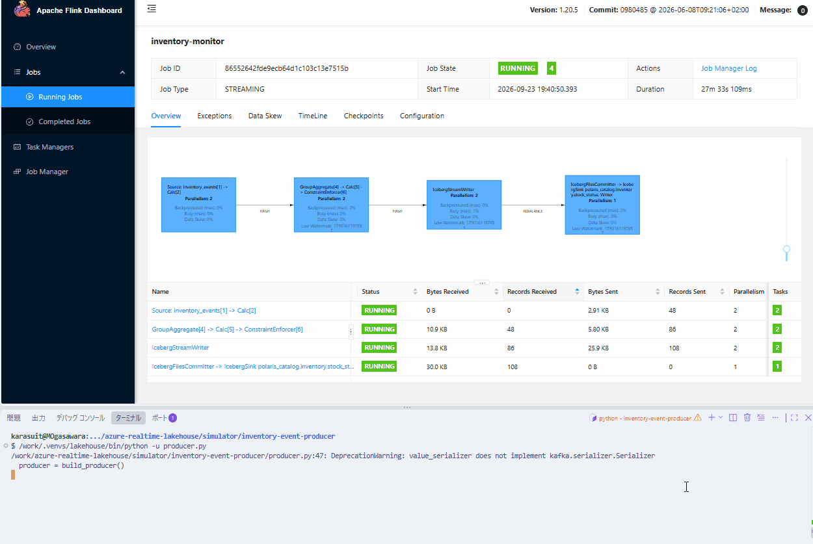
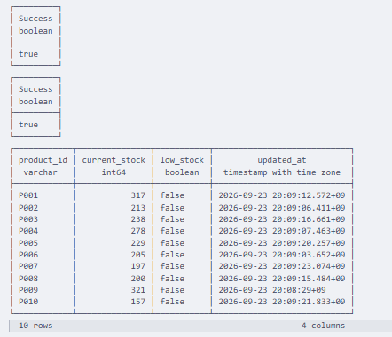
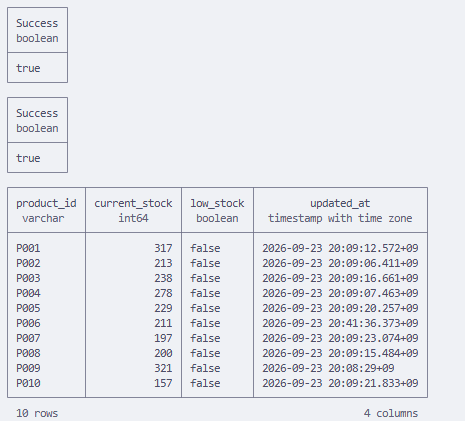

# Azure Realtime Lakehouse

在庫減少をリアルタイムに検知するストリーミング基盤。Azure Event Hubs → Flink on AKS → Apache Iceberg（ADLS2 + Apache Polaris）という構成で、「日次バッチでは検知が翌朝になる」という遅延を解消することにフォーカスしたポートフォリオです。

---

## なぜこれをやるのか

従来の在庫管理は日次バッチ集計が前提になっていることが多く、当日発生した欠品は翌朝のバッチ実行まで検知されません。その間、機会損失（商品があれば売れていたはずの売上を失う）と過剰在庫リスク（欠品が怖いから多めに持つ、という安全マージン）の両方にトレードオフが生じます。ストリーミングで在庫変動をリアルタイムに検知できれば、検知ラグが縮む分だけこのトレードオフ自体を緩和できる、というのがこのプロジェクトの仮説です。

このリポジトリが実装するのは、**在庫減少のリアルタイム検知〜Icebergテーブルへの格納までのストリーミング基盤部分**です。検知結果を受けた自動発注ロジックや、発注先システムとの連携は対象外です。あくまで「リアルタイム性のある検知基盤を、本番運用を想定した構成（IaC化・K8s運用）で構築できる」ことの証明が目的です。

---

## アーキテクチャ

- **Event Hubs**：Kafka protocol互換エンドポイントを使い、Flinkからは通常のKafkaソースとして接続する
- **Flink on AKS**：Flink Kubernetes OperatorでFlinkDeployment CRDとしてジョブを管理。商品ごとに現在庫数をstateとして保持し、イベントごとに即時更新・閾値判定した結果をIcebergにsink
- **ADLS2 + Polaris**：データ実体はADLS2に、テーブルの最新状態（metadata.jsonへのポインタ）はPolarisが管理。クラウド中立なREST Catalog仕様で構築し、特定ベンダーへのロックインを避ける

---

## 動作デモ

実機（Azure）で実際に動かした際のキャプチャ。

**① イベント処理の様子（Flink Web UI）**

シミュレータからEvent Hubsへイベントを送信すると、Flinkのジョブグラフ上で各オペレータの処理件数がリアルタイムに増えていく。

**② Icebergテーブルの実データ（変更前）**

DuckDBでPolarisのREST Catalog経由でIcebergテーブルを直接読み出した状態。`P006`は205個。

**③ Icebergテーブルの実データ（変更後）**

`P006`に対してSALE 4個・RESTOCK 10個を送信した後の状態。`205 - 4 + 10 = 211`個に正しく更新されており、他の商品は変化していない。

---

## 技術スタック

| レイヤ | 技術 |
|---|---|
| メッセージング | Azure Event Hubs（Kafka protocol互換） |
| ストリーム処理 | Apache Flink（Flink Kubernetes Operator） |
| コンテナ基盤 | Azure Kubernetes Service (AKS) |
| ストレージ | Azure Data Lake Storage Gen2 (ADLS2) |
| テーブルフォーマット | Apache Iceberg |
| カタログ | Apache Polaris（Iceberg REST Catalog） |
| 認証 | Azure AD Workload Identity（Flink・Polarisとも専用identity、shared key不使用） |
| インフラ | Terraform |
| CI/CD | GitHub Actions（OIDC認証） |

---

## 検証状況

実機（Azure従量課金）で全レイヤーを確認済み。

| 層 | 状態 |
|---|---|
| Terraform（17リソース、Workload Identity含む） | 確認済み |
| Event Hubs ⇔ シミュレータ | 確認済み |
| AKS / Flink Kubernetes Operator | 確認済み |
| Polaris（カタログ・専用principal初期化） | 確認済み |
| FlinkDeployment（Kafka → Iceberg on Polaris） | 確認済み |
| Icebergへの書き込み・スナップショットコミット | 確認済み |
| Workload Identity（Flink・Polarisとも専用identity化） | 確認済み |
| `upgradeMode: last-state`（redeploy時の状態引き継ぎ） | 確認済み |
| CI/CD（terraform apply/destroy、OIDC認証） | 確認済み |
| Icebergメンテナンス（スナップショット期限切れ削除） | 確認済み（GitHub Actions経由は既知の制約あり、詳細は下記） |

技術的な詰まりどころ・デバッグの詳細は [docs/engineering-notes.md](docs/engineering-notes.md) 参照。

---

## 設計判断（抜粋）

**なぜAzure純正のカタログではなくApache Polarisを使うのか**
目指しているのは「ベンダー中立」ではなく「移行容易性」。カタログをAzure独自仕様にすると、データ資産の「正」の管理が特定ベンダーに癒着し出口を塞ぐため、REST Catalog仕様準拠のPolarisを採用した。

**なぜFlink Kubernetes Operatorを使うのか**
FlinkDeploymentというCRDでジョブをKubernetesネイティブに管理でき、デプロイ・スケーリング・障害復旧がkubectl/Terraform経由で完結する。AKS運用力を証明する目的上、K8sネイティブな運用フローを採用した。

**exactly-once保証はどう実現しているか**
Kafka offsetのスナップショットとIcebergへのsnapshot commitを、Flinkのcheckpoint機構で同期させる2相コミット的な仕組み。checkpoint失敗時はそのoffsetまで巻き戻して再処理するため、Iceberg側に未完了のcommitが残らない。

**なぜPostgresやTrinoを追加しないのか**
Icebergはストレージ＋カタログだけで完結し専用DBサーバーを持たない。動作確認は`pyiceberg`/DuckDBによるカタログ越しの直接読み出しで足りるため、常時稼働のクエリエンジンを増やすコストに見合わないと判断した。

**検知ロジックはなぜstateful processing（`GROUP BY`）なのか**
在庫数は「期間内の変化量」ではなく「今この瞬間の値」であり、ウィンドウ集計とは構造が合わない上、ウィンドウが閉じるまで待つ遅延が「即座に検知する」という前提と矛盾するため。

**Polaris自身もAzureへのIAM権限が要る、という気付き**
Flinkのshared-key認証とは別に、Polarisサーバー自身がCREATE TABLE時にストレージ場所を検証するため、自分の身元でAzureにアクセスする。明示的な認証情報を渡していなかったため既定でAKSノードのManaged Identityを使ってしまい、権限不足でエラーになった。マネージドサービスでは意識する必要のない、「自前ホスティングのストレステスト」という本プロジェクトの狙いが最も色濃く出た学び（詳細は[docs/engineering-notes.md](docs/engineering-notes.md)）。

**shared key/kubelet identityからWorkload Identityへの移行**
上記の気付きを受け、Flink・Polarisそれぞれに専用のAzure identityをKubernetesのServiceAccountと直接紐づける形に変更した。Icebergの実データ読み書きは完全にkeylessになった（Flinkのチェックポイント用ドライバのみ、ライブラリバージョンの制約でshared keyが一部残る）。

**コスト運用方針**
ポートフォリオ規模のため検証セッションごとにインフラをapply/destroyする運用。予算アラート設定済みで、常時稼働はしない。

---

## もっと詳しく

- 技術的な詰まりどころ・個別バグの調査記録・動かし方の詳細手順： [docs/engineering-notes.md](docs/engineering-notes.md)
